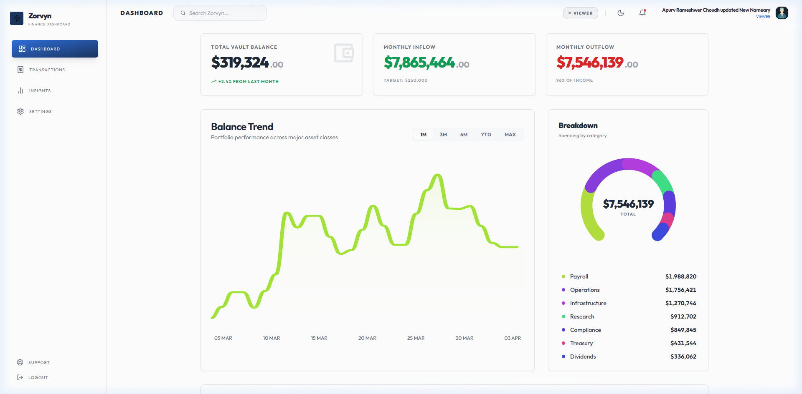
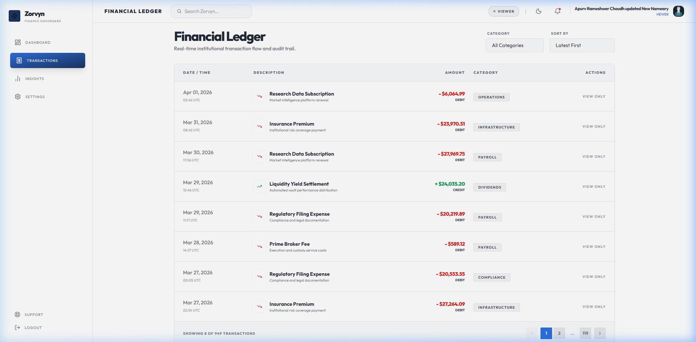
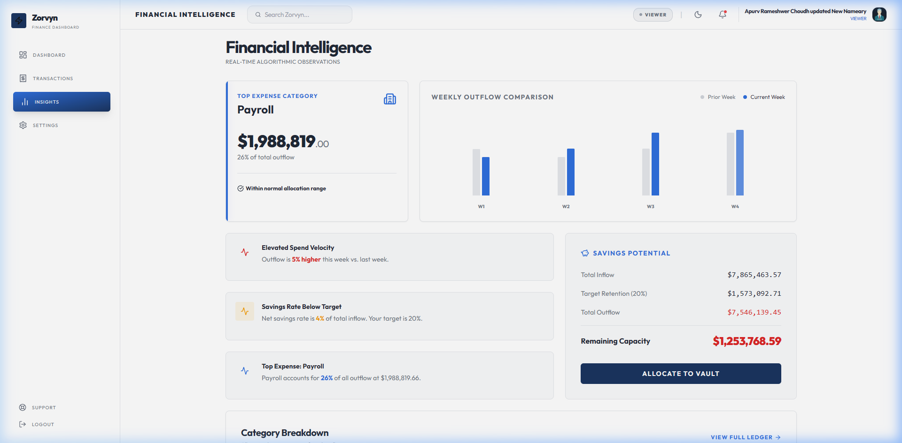
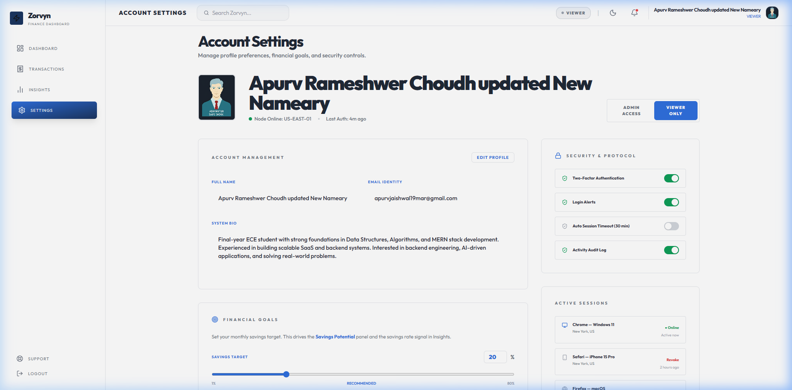

# Zorvyn — Finance Dashboard UI

> Frontend internship assignment submission for **Zorvyn FinTech Pvt. Ltd.**  
> Built by **Apurv Rameshwer Choudhary**  
> 🌐 **Live Demo:** [https://zorvyn-rust.vercel.app/dashboard](https://zorvyn-rust.vercel.app/dashboard)

A clean, interactive, and animated finance dashboard built with React + Vite. Features role-based UI simulation, real-time data visualizations, and full dark/light mode support.

---

## Screenshots

### Dashboard


### Transactions


### Insights


### Settings


---

## Tech Stack

| Layer | Technology |
|---|---|
| Framework | React 18 + Vite |
| Routing | React Router v6 |
| Styling | Tailwind CSS v3 |
| Animation | Framer Motion |
| Icons | Lucide React |
| State | React Context API |
| Persistence | localStorage |

---

## Setup & Running

```bash
# Install dependencies
npm install

# Start development server
npm run dev

# Build for production
npm run build
```

App runs at `http://localhost:5173`

---

## Core Features Implemented

- ✅ **Dashboard Overview with Summary Cards** — Total Vault Balance, Monthly Inflow, and Outflow with animated count-up numbers.
- ✅ **Time Based Visualization (e.g., Balance Trend)** — Animated Balance Trend line chart with time filters.
- ✅ **Categorical Visualization (e.g., Spending Breakdown)** — Interactive Spending Breakdown donut chart.
- ✅ **Transaction List with Details** — Full ledger detailing Date/Time, Description, Amount, Category, and Type.
- ✅ **Transaction Filtering** — Category filter dropdown to isolate specific spending categories.
- ✅ **Transaction Sorting or Search** — 4-way sorting and real-time Global Search bar in the header.
- ✅ **Role Based UI (Viewer and Admin)** — Instant role toggle. Admins can add/edit/delete; Viewers are read-only.
- ✅ **Insights Section** — Algorithmic analysis of Top Expenses, comparisons, and dynamic spending signals.
- ✅ **State Management (Context, Redux, Zustand, etc.)** — Global state handled centrally via React Context API.
- ✅ **Responsive Design** — Fully adaptive layout for mobile and desktop screens.

---

## Detailed Feature Breakdown

### 1. Dashboard Overview
- **Summary cards** — Total Vault Balance, Monthly Inflow, Monthly Outflow with animated count-up numbers
- **Balance Trend chart** — Animated SVG line chart with 5 time filters (1M, 3M, 6M, YTD, MAX), smooth cubic bezier curves, hover tooltip with date/amount/delta
- **Spending Breakdown** — Interactive donut chart with per-category hover highlights
- **Recent Transactions** — Live feed of the latest ledger entries

### 2. Transactions (Financial Ledger)
- **Comprehensive Ledger** — Detail-rich table with Date/Time, Description, Subtitle/Reference, Amount, Category, and Type.
- **Unified Filter System** — Single "Filters" dropdown containing:
    - **Category filter** — isolate specific spending pools.
    - **Tiered Sorting** — 4-way sorting (Latest, Oldest, Amount High→Low, Amount Low→High).
    - **Amount Range** — filter by "Min" and "Max" numeric values.
    - **Date Range** — precise "Start Date" to "End Date" isolation.
- **Staging & Validation** — Stage multiple filter changes and click **"Apply Filters"** to commit. Features real-time error validation (e.g., Min > Max warnings) and an auto-lock on the apply button for illegal states.
- **Global Search** — Dedicated search bar in the header filters transactions by title or category in real-time.
- **Pagination** — 8 items per page with smart ellipsis pagination and state preservation.
- **Export Engine** — One-click download as **CSV** or **JSON**, fully synchronized with your current filtered view.

### 3. Role-Based UI (Frontend Simulation)
Switch roles instantly via the **`● Admin` / `● Viewer` pill** in the top bar (no reload needed).

| Action | Admin | Viewer |
|---|---|---|
| View all data | ✅ | ✅ |
| Add transaction | ✅ | ❌ |
| Edit transaction | ✅ | ❌ |
| Delete transaction | ✅ | ❌ |
| Actions column | Edit + Delete buttons | "View Only" label |

Role is persisted in `localStorage` so it survives page refreshes.

### 4. Insights
- **Top Expense Category** — highest spend with % of total outflow
- **Monthly Flow Comparison** — weekly bar chart comparing this month vs last
- **Spending by Category** — all categories ranked by outflow with color-coded bars
- **Dynamic Signals** — algorithmic observations: spending velocity vs prior week, savings rate vs target, category dominance warnings
- **Savings Potential card** — inflow vs retention vs deployment capacity

### 5. Settings
- **Profile** — editable full name, email, bio
- **Security** — 2FA status, active session management, security protocols list
- **Display** — dark/light mode toggle, motion/animation toggle
- **Savings Goal** — adjustable target savings rate (1–80%) used by Insights signals

### 6. Export Functionality
- **Dual Format Support** — One-click export download as **CSV** or **JSON** available on the Transactions page.
- **Data Synchronization** — The export strictly follows your active filters (Search, Range, Category).
- **Audit Ready** — Includes a `RawValue` field (numeric) alongside the formatted string for easier processing in Excel/accounting tools.
- **Dynamic Filenaming** — Automatically generates timestamps in filenames (e.g., `zorvyn_export_2026-04-04.csv`).

### 7. State Management
All state lives in `AppContext` and is exported via `useAppContext()`:

| State | Description |
|---|---|
| `activeRole` | "Admin" or "Viewer" — persisted to localStorage |
| `transactions` | Full transaction array, supports add/update/delete |
| `searchTerm` | Global search string — filters `filteredTransactions` |
| `selectedCategory` | Global Category filter value |
| `minAmount` / `maxAmount` | Amount range filter bounds |
| `startDate` / `endDate` | Date range filter bounds (ISO strings) |
| `sortOrder` | "latest" / "oldest" / "amount-high" / "amount-low" |
| `theme` | "light" or "dark" — persisted to localStorage |
| `motionEnabled` | Enables/disables all Framer Motion animations |
| `userProfile` | Name, email, bio — persisted to localStorage |
| `savingsGoal` | Target savings % — persisted to localStorage |
| `auditCompliance` | Calculated % of categorized transactions |

Derived values (totals, filteredTransactions, spendingCategories, insights signals, etc.) are computed with `useMemo` and never stored redundantly.

---

## Optional Enhancements Implemented

- ✅ **Dark mode** — full class-based dark mode with toggle, persisted to localStorage.
- ✅ **Data persistence (local storage)** — role, theme, profile, savings goal all survive page refresh.
- ✅ **Mock API integration** — static/mock transaction data setup simulating a real API environment.
- ✅ **Animations or transitions** — Framer Motion page transitions, chart draw-in, count-up numbers, donut arc animations.
- ✅ **Export functionality (CSV/JSON)** — Optimized exports with raw numeric values and dynamic naming.
- ✅ **Advanced filtering** — Unified staged filtering with amount/date ranges and real-time validation.

---

## Project Structure

```
src/
├── components/
│   ├── TopBar.jsx          # Header with search, role toggle, theme
│   ├── SideNav.jsx         # Sidebar navigation + mobile drawer
│   └── TransactionModal.jsx # Add/Edit transaction form (Admin only)
├── pages/
│   ├── dashboard/
│   │   └── Dashboard.jsx   # Main dashboard with chart + breakdown
│   ├── transactions/
│   │   └── Transactions.jsx # Financial ledger with filtering/sorting
│   ├── insights/
│   │   └── Insights.jsx    # Algorithmic spending insights
│   └── settings/
│       └── Settings.jsx    # Profile, security, display preferences
├── context/
│   └── AppContext.jsx      # Global state + all derived data
├── configs/
│   └── navigationConfig.js # Sidebar and top menu link definitions
├── assets/
│   ├── assets.js           # Mock transaction data + static config
│   └── screenshot-*.png    # Demo assets
├── App.jsx                 # Route definitions + Toast notifications (react-hot-toast)
├── main.jsx                # Entry point with AppProvider
└── index.css               # Global styles + Tailwind config
```

---

## Notes & Assumptions

- All data is **mock/static** — no backend dependency, as specified in the assignment
- Role-based behavior is **intentionally frontend-only** as the assignment requires
- Amount values are stored as formatted strings (e.g., `"- $2,490.00"`) and parsed numerically for calculations
- The Balance Trend chart uses **generated time-series data** derived from the transaction dataset to simulate portfolio value over time

---

*Submission for Zorvyn FinTech Pvt. Ltd. — Frontend Developer Intern Assignment*  
*Deadline: Mon, 06 Apr 2026, 10:00 PM*
